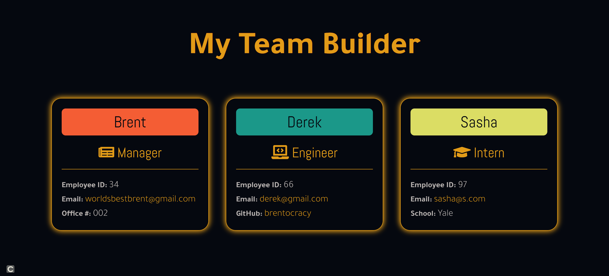
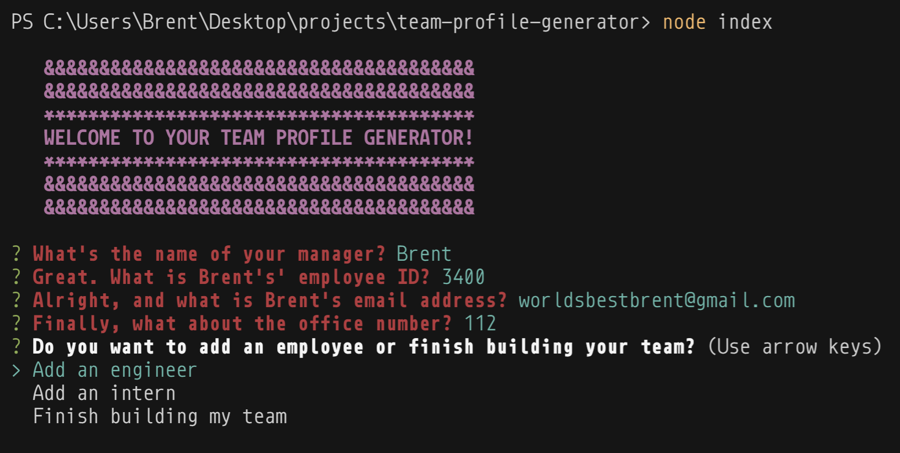
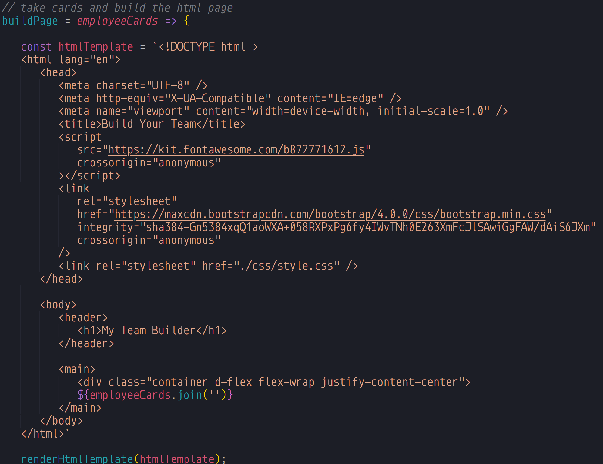

# Team Profile Generator

  

  

<br>


## TABLE OF CONTENTS
  1. [Description](#description)
  2. [Installation](#installation)
  3. [Usage](#usage)
  4. [Technologies](#technologies)
  5. [Contribution](#contribution)
  6. [Testing](#testing)
  7. [License](#licensing)
  8. [About](#about)

## Description

Fill out some command prompts over a few minutes and be given a beautiful-looking team profile page, using a combination of Bootstrap and custom CSS! A perfect application for someone who needs to spin up an organized employee list with necessary information. A CSS stylesheet is included for aesthetics, but the stylesheet is also fully customizable if the user so desires to style the page him or herself.

### This project can be found:

- [GitHub Repository](https://github.com/brentocracy/team-profile-generator)

---

## Installation

You must have [Node.js](https://nodejs.org/en/) installed.

Go to the [repository](https://github.com/brentocracy/team-profile-generator) and clone it by entering ``` git clone https://github.com/brentocracy/team-profile-generator.git```. In order to run the application to generate your page, make sure you install the following dependencies:

#### *Inquirer*
`npm install inquirer` for all prompts.

#### *Chalk*
`npm install chalk` for console styling.

#### *Email Validator*
`npm install email-validator` for email validation prompt.

#### *Jest*
`npm install jest`, then go to your `package.json` file and change the test attribute to jest. Then add the capacity for coverage when testing. It should look like this:
```c
    "scripts": {
    "test": "jest",
    "test:coverage": "jest --coverage"
  },
```

Imports are included in the code as such:

```c
    const inquirer = require('inquirer');
    const validator = require('node-email-validation');
    const chalk = require('chalk');
    const fs = require('fs');
```
---

## Usage

Open up your preferred terminal window and launch the application with `node index`. 

You will immediately be welcomed and prompted in your console. Use is very simple -- the first series of questions is for the manager at your company (whether you or someone else). All prompts are required to be filled out and email addresses must be validated through the "a@b.c" formatting.

After the end of the manager information prompt, you will be given a choice: add an engineer, add an intern, or finish building the team (thus rendering the HTML from your given list of employees).

You're finished! Go to your `/dist` directory and you will find your `index.html` landing page, along with a `css.style` file, which is fully editable if so desired. **Be mindful that Bootstrap was used and imported to create the mobile-responsive flex layout.** Bootstrap can, however, be easily overriden by adding CSS properties to classes of the same name (as has already been done).

> *NOTE: To overwrite your team profile with a new one, launch the application and fill out the prompts again. The `index.html` file will be automatically overriden with the new information.*

A walk-through video on going through the application can be found [here](https://drive.google.com/file/d/1dXAWhLq-AGHXjJbjyYPYDpzhLvFEuK1f/view?usp=sharing).

### General

The application contains two joint ventures, separated into distinct scripting files: `prompts.js` and `html-output.js`. More on each below.

#### User Prompting

As noted above, you will be prompted from the beginning to input the name, email, employee ID, and office number of your manager. Once this is completed, you will be given the choice to add an engineer, add an intern, or finish up.



*Fig. 1: The user has a choice at the end of each employee information prompt*

An engineer and an intern will get the same prompts except for the last, which will ask an engineer for his or her GitHub username, and an intern for his or her school.

The prompts are rigid and required for now, but future versions will be more dynamic with a wider range of inputs.

#### Team Profile Page Generation



*Fig 2: This is the HTML skeleton template; all employee cards are joined into the card container for display*


Once you finish building your team, the application then takes your list of employee information and writes it into an `index.html` file:

```c
   renderHtmlTemplate = async (htmlTemplate) => {
   // create html template file in /dist directory
   try {
      await fs.writeFileSync('./dist/index.html', htmlTemplate)

   } catch (err) {
      console.log(`${err} -- Something went wrong when writing your file!`);
   }
};
```


---

## Technologies

> The following were used in this project:

- `HTML`
- `CSS`
- `Bootstrap`
- `JavaScript`
- `Node.js`
- `Git`
- Coded in `VS Code`

---

## Contribution

If you would like to contribute to this project:

Navigate to your workspace in your terminal and clone the repository code there using `git clone`. Make sure to create your own branch with `git checkout -b branch-name` and push all changes with `git push origin branch-name` to open up a pull request. 

---

## Testing

In order to run the fundamental testing apparatus of the application in which all four classes (Manager, Engineer, Intern, and the Employee super-class which has its properties inherited by the others), run `Jest` by typing `npm test` into your terminal.

For a more detailed layout which shows you every line, function, and script file tested, you can use the `npm test -- --coverage` command.

To add tests, you can append whichever tests you'd like on to the respective class test file. A standard `Jest` test looks something like this:

```c
   test(`getSchool() returns a string`, () => {
   const intern = new Intern('Brent', '23', 'brentgaines@gmail.com', 'School of Brent');

   expect(intern.getCard()).toEqual(expect.any(String));
});
```

The name of the test followed by a function which instantiates a mock of whichever object/array/function/variable is being tested, followed by what should be the expected result of the test.


## Licensing

This application is operating under the `MIT` license.

## About

I am a Full-Stack Web Developer committed to building fun and efficient projects, and also very excited for hockey season.

I'm always available for collaboration and pleasantries.

Kindly reach out at <brentmatthewgaines@gmail.com>!


